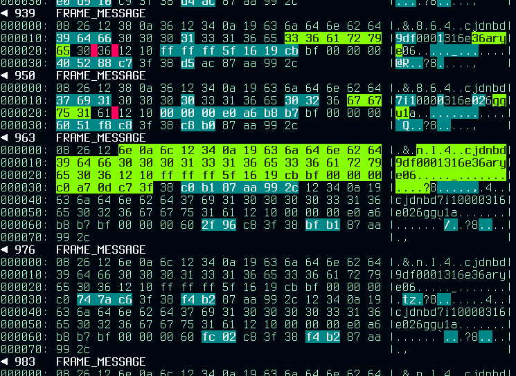

`M U L T I D I F F`
===================

> Multidiff is a sensory augmentation apparatus

Its purpose is to make machine friendly data easier to understand by humans that are looking at it.
Specifically multidiff helps in viewing the differences within a large set of objects by doing diffs between relevant objects and displaying them in a sensible manner.
This kind of visualization is handy when looking for patterns and structure in proprietary protocols or weird file formats.
The obvious use-cases are reverse engineering and binary data analysis.

At the core of multidiff is the python difflib library and multidiff wraps it in data providing mechanisms and visualization code.
The visualization is the most important part of the project and everything else is just utilities to make it easier to feed data for the visualizer.
At this time the tool can do basic format parsing such as hex decoding, hexdumping, and handling data as utf8 strings, as well as read from files, stdin, and sockets.
Any preprocessing such as cropping, indenting, decompression, etc. will have be done by the user before the objects are provided to multidiff.

Command-line interface
----------------------
The command line interface is the easiest way to use multidiff. It supports a few common use-cases and is installed by the setup script.

	python3 setup.py install
	multidiff -h

### --mode
This selects the diffing strategy, currently `sequence` and `baseline` are supported.
Sequence mode diffs every object with the object added just before it while baseline mode always diffs the most recent object with the first object.

### --informat & --outformat
The `infomrat` argument controls what kind of transformations should be done to the data before it gets diffed. `outformat` controls the view of the output data.
`informat` should mostly be selected based on what is the easiest way to provide data to multidiff while `outformat` should be selected based on how the content of the data is most pleasantly viewed.

### --port
There is an embedded tcp socket server that will listen to any packets coming to the specified port and print the diffs as more objects are sent to it.
The server supports a json mode in which objects are passed as json objects that may include metadata. This is useful if the client has done some analysis on the data and one would like to show those results in the view stream. The schema is pretty simple:

	{
		"data":"[data encoded as base64]",
		"info":"some useful note"
	}

Example object providers are in the `examples` directory.
These are specific use-cases where it has been helpful to have a stream of diffs visible when inspecting traffic.

Examples
--------

Check how much your shell history repeats:

	history | multidiff -s -o utf8
	
Diff a bunch of files and scroll through the results:

	multidiff interesting_file.bin folder_with_similar_files/ | less -r

Start a multidiff server, then send objects to it:

	multidiff -p 8000
	echo "interesting" | nc 127.0.0.1 8000
	echo "intersectional" | nc 127.0.0.1 8000

Contributions
-------------
Pull requests are welcome, and please raise an issue if something is broken or if you can think of a cool feature. I can be reached as "stilla" on Protonmail.
